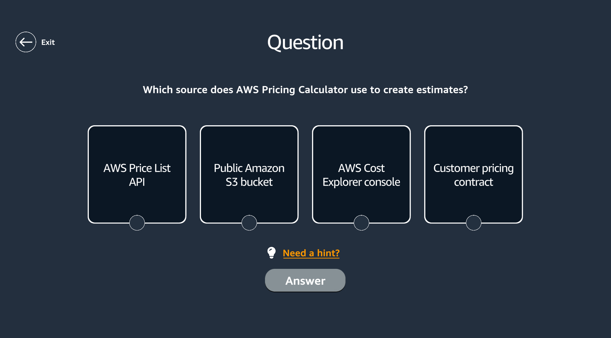
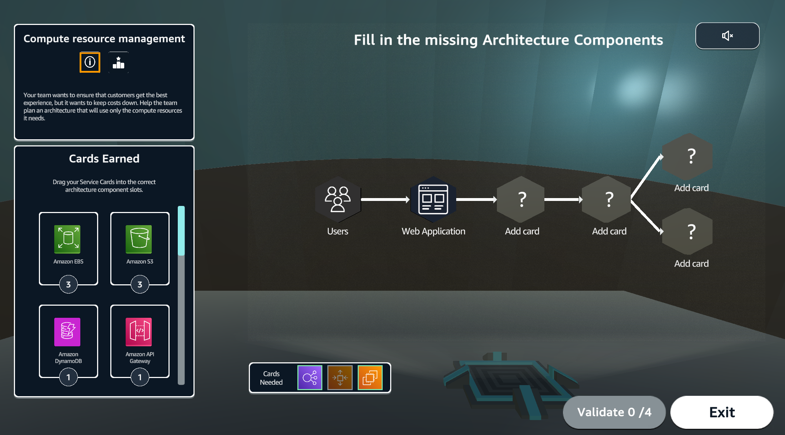
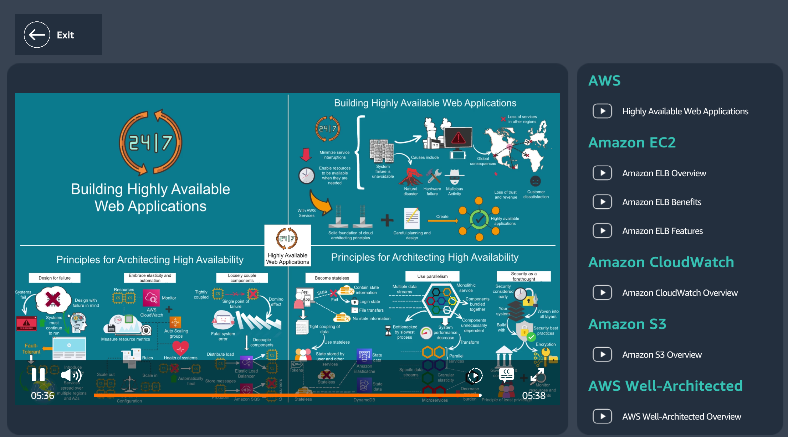
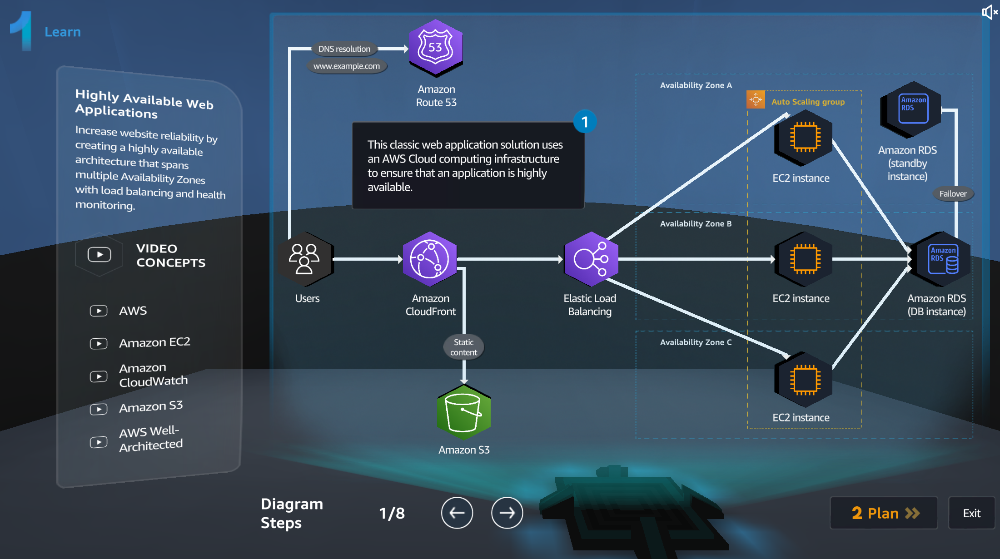
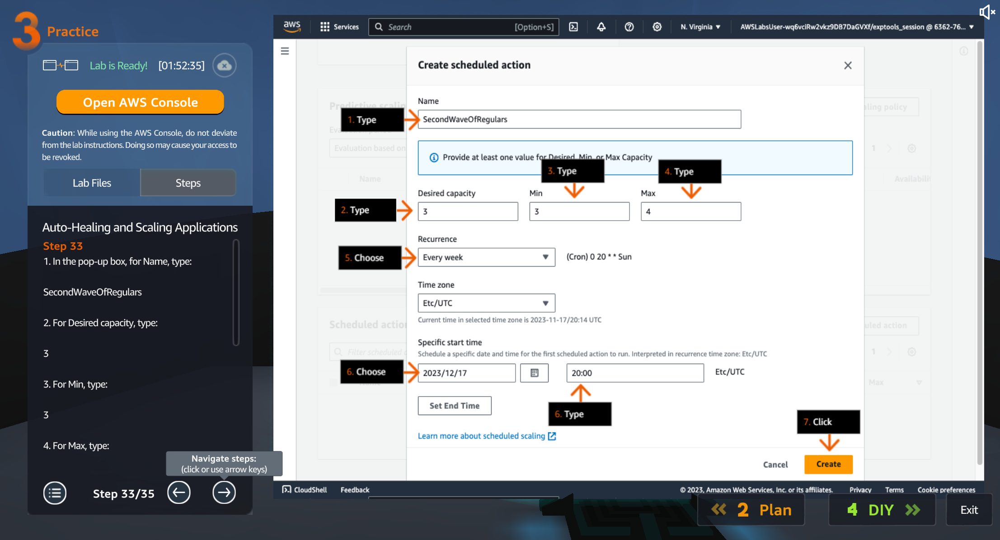
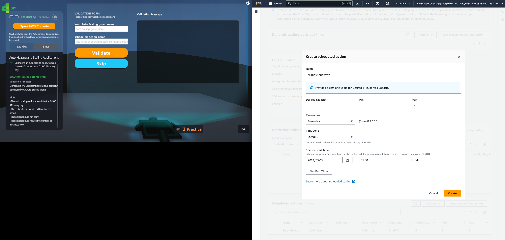
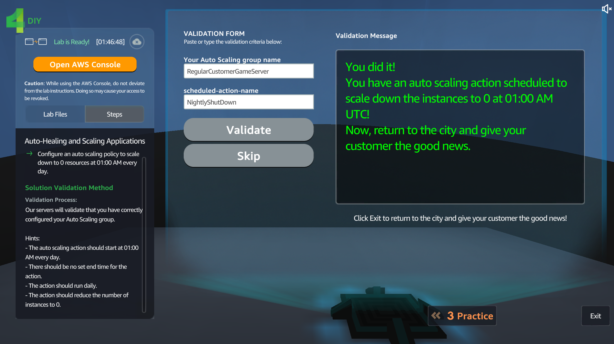

# Beginner Level AWS Training Suggestions

## Overview
This document provides suggestions for the next ICP Bootcamps and new joiners with minimal or non-existing knowledge of AWS. It highlights two key resources: "Cloud Quest: Cloud Practitioner" and "Cloud Essentials," both accessible through AWS's Skill Builder platform.

## Cloud Quest: Cloud Practitioner

### What is Cloud Quest: Cloud Practitioner?
Cloud Quest: Cloud Practitioner is a virtual open-world game designed to help users learn AWS. It incorporates game-thinking principles in instructional activities. Players solve problems using the AWS console, earn rewards, and customize their virtual city and avatar. It offers 12 hands-on assignments covering various AWS services like S3, Auto Scaling, and Load Balancing, providing a practical, engaging learning experience for free and other learning paths with subscription.

### Accessing Cloud Quest
Cloud Quest can be accessed at [Skill Builder - Cloud Quest](https://explore.skillbuilder.aws/learn). Users can find the game by searching for Cloud Quest or navigating through the Game-Based Learning - Free Catalog. Enrollment and game access are straightforward, requiring AWS Skill Builder sign-in.

### Training Duration
Approximately 12 hours of digital training are available within the free tier.

## Cloud Essentials

### About Cloud Essentials
Cloud Essentials is a structured learning path introducing AWS Cloud fundamentals, including core services, security, architecture, pricing, and support. It includes various courses, knowledge checks, and an assessment for the AWS Knowledge badge.

### Intended Audience
The learning path is designed for individuals new to AWS Cloud, aiming to gain a comprehensive understanding of AWS Cloud fundamentals, irrespective of their specific technical roles.

### AWS Knowledge Badge
Participants can earn an AWS Knowledge Badge by scoring 80% or higher on the assessment.

### Training Duration
The Cloud Essentials path offers around 10 hours of digital training.

## Conclusion
For ICP Bootcamps and Accenture, utilizing these AWS training resources could be beneficial. With Cloud Quest and Cloud Essentials, learners can gain practical and theoretical knowledge of AWS, on Accenture side it could save 2 to 3 days of personel time requiring only the verification of learning badges.

Access both learning paths at [AWS Skill Builder](https://explore.skillbuilder.aws/).

## Screenshots

*Individual Quizzes*

*Architecture Components Quiz*

*Learning Video*

*Learning Stage*

*Practice Stage*

*DIY Stage*

*Result Validation*