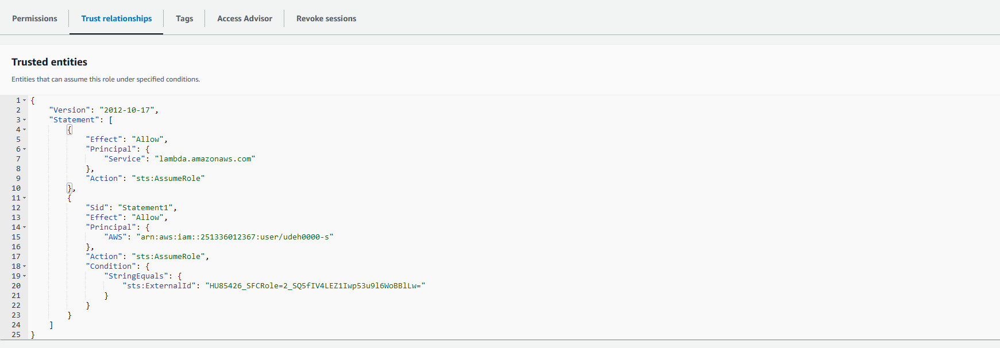

# Integration of AWS Lambda with Snowflake for use within Stored Procedures

This document outlines the steps required to integrate AWS Lambda with Snowflake, enabling Snowflake to invoke an AWS Lambda function. This integration facilitates the creation of various event-driven actions, ranging from executing custom code, backend services to integrating with SQS, SNS, and more.

## Resources and Documentation

For detailed code examples and more information, refer to the Snowflake documentation on creating AWS common API integration: [Snowflake Documentation](https://docs.snowflake.com/en/sql-reference/external-functions-creating-aws-common-api-integration)

## AWS Lambda Function Example

Below is a Python code snippet for an AWS Lambda function. This function is triggered by Snowflake to perform a specific task and return a response.

```python
import json

def lambda_handler(event, context):
    # Extracting the "message" from the event object.
    message = event.get('message', 'Hello from Lambda')
    
    # Constructing the response as an array of arrays with the message
    response_data = [[0, message]]
    
    # Creating the final response object
    response = {"data": response_data}
    
    # Returning the JSON response
    return {
        'statusCode': 200,
        'body': json.dumps(response),
        'headers': {'Content-Type': 'application/json'},
    }
```

## Configuring Snowflake

### Set the Role with Account Admin Privileges

```sql
USE ROLE <has_accountadmin_privileges>;
```

### Create API Integration

Create an API integration in Snowflake to connect with the AWS Lambda function.

```sql
CREATE OR REPLACE API INTEGRATION ms_snowflake_external_function
    API_PROVIDER = aws_api_gateway
    API_AWS_ROLE_ARN = '<IAM_role_ARN>'
    API_ALLOWED_PREFIXES = ('<Lambda trigger endpoint URL>')
    ENABLED = true;
```

### Describing Integration and Setting Up Trust Relationships

Retrieve the API integration details and set up trust relationships as described in the Snowflake documentation.

```sql
DESCRIBE INTEGRATION ms_snowflake_external_function;
```




Refer to the documentation link for setting up trust relationships: [Trust Relationship Setup](https://docs.snowflake.com/en/sql-reference/external-functions-creating-aws-common-api-integration-proxy-link)

### Creating External Function

Define an external function in Snowflake to call the AWS Lambda function.

```sql
CREATE OR REPLACE EXTERNAL FUNCTION ms_post_to_lambda(message VARCHAR)
    RETURNS VARIANT
    API_INTEGRATION = ms_snowflake_external_function
    AS '<Lambda trigger endpoint URL>';
```

### Creating a Procedure to Call the External Function

```sql
CREATE OR REPLACE PROCEDURE ms_snowflake_procedure(message VARCHAR)
    RETURNS STRING
    LANGUAGE JAVASCRIPT
    EXECUTE AS CALLER
    AS $$
        try {
            var result = snowflake.execute({sqlText: `SELECT ms_post_to_lambda(:1) AS result_message`, binds: [MESSAGE]});
            result.next(); // Move to the first row in the result set
            var resultObject = result.getColumnValue(1); // Retrieves the JSON object
            var resultString = (typeof resultObject === 'string') ? resultObject : JSON.stringify(resultObject);
            return "Message from Lambda: " + resultString;
        } catch (err) {
            return "Error posting message to Lambda: " + err;
        }
    $$;
```

### Executing the Procedure

```sql
CALL ms_snowflake_procedure('Any message here');
```


## Cleanup

To clean up resources:

```sql
-- Clean up Snowflake resources
DROP PROCEDURE ms_snowflake_procedure(VARCHAR);
DROP FUNCTION ms_post_to_lambda(VARCHAR);
DROP INTEGRATION ms_snowflake_external_function;
```


## Next Steps

- Explore sending variable data to Lambda for dynamic action determination.
- Consider automating setup and deployment using Terraform and Ansible for infrastructure as code practices.

## Additional Information
- I leveraged ChatGPT-4 to enhance the appearance and feel of the .md file. The underlying commands and logic were crafted by me or found on internet and tweaked to fit my needs.