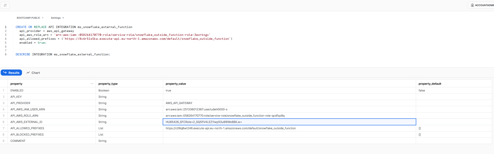
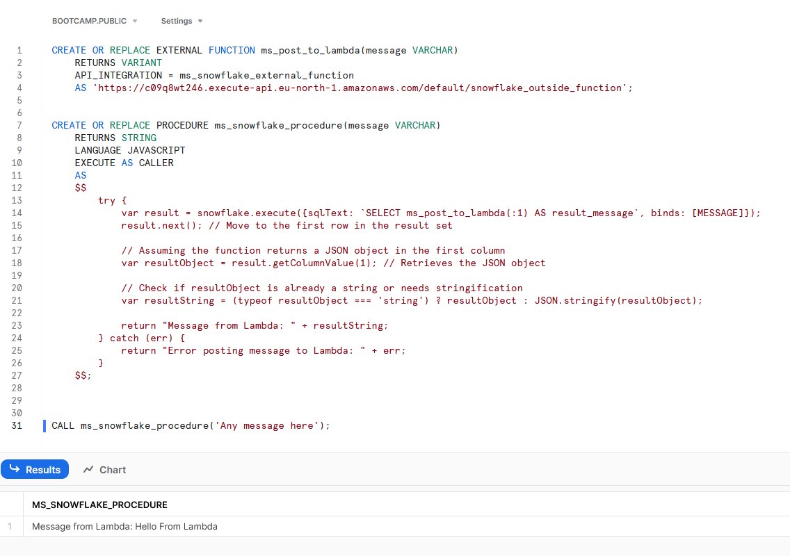
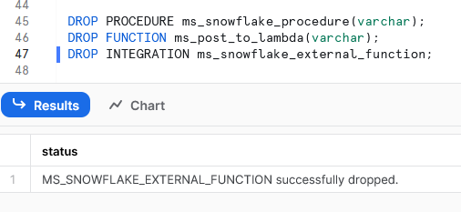

Code examples and more information can be found here: https://docs.snowflake.com/en/sql-reference/external-functions-creating-aws-common-api-integration

AWS Lambda:
```python
import json

def lambda_handler(event, context):
    # Extracting the message from the event object.
    # Assuming the message is sent in a field named 'message'.
    message = "Hello from Lambda"
    
    # Constructing the response as an array of arrays with the message
    response_data = [
        [0, message]  # Using the extracted message here
    ]
    
    # Creating the final response object with 'data' containing the response_data
    response = {
        "data": response_data
    }
    
    # Returning the JSON response
    return {
        'statusCode': 200,
        'body': json.dumps(response),
        'headers': {
            'Content-Type': 'application/json',
        },
    }
```

Snowflake:
```sql
use role <has_accountadmin_privileges>;
```

```sql
CREATE OR REPLACE API INTEGRATION ms_snowflake_external_function
    api_provider = aws_api_gateway
    api_aws_role_arn = '<IAM_role_ARN>'
    api_allowed_prefixes = ('<Lambda triger endpoint URL>')
    enabled = true;
```

Write down the data you'll get from the code below and fill out the trust relationship as described here: https://docs.snowflake.com/en/sql-reference/external-functions-creating-aws-common-api-integration-proxy-link

```sql
DESCRIBE INTEGRATION ms_snowflake_external_function;
```



```sql
CREATE OR REPLACE EXTERNAL FUNCTION ms_post_to_lambda(message VARCHAR)
    RETURNS VARIANT
    API_INTEGRATION = ms_snowflake_external_function
    AS 'Lambda triger endpoint URL';
```

```sql
CREATE OR REPLACE PROCEDURE ms_snowflake_procedure(message VARCHAR)
    RETURNS STRING
    LANGUAGE JAVASCRIPT
    EXECUTE AS CALLER
    AS
    $$
        try {
            var result = snowflake.execute({sqlText: `SELECT ms_post_to_lambda(:1) AS result_message`, binds: [MESSAGE]});
            result.next(); // Move to the first row in the result set

            // Assuming the function returns a JSON object in the first column
            var resultObject = result.getColumnValue(1); // Retrieves the JSON object

            // Check if resultObject is already a string or needs stringification
            var resultString = (typeof resultObject === 'string') ? resultObject : JSON.stringify(resultObject);

            return "Message from Lambda: " + resultString;
        } catch (err) {
            return "Error posting message to Lambda: " + err;
        }
    $$;
```

```sql
CALL ms_snowflake_procedure('Any message here');
```



Cleanup:
- Delete the Lambda function and role

- Clean Snowflake
```sql
DROP PROCEDURE ms_snowflake_procedure(varchar);
DROP FUNCTION ms_post_to_lambda(varchar);
DROP INTEGRATION ms_snowflake_external_function;
```



TODO:
- Send some kind of variable to Lambda that could be interpreted and a specific action taken depending on what it is.
- Automate things through Terraform and, possibly, Ansible.