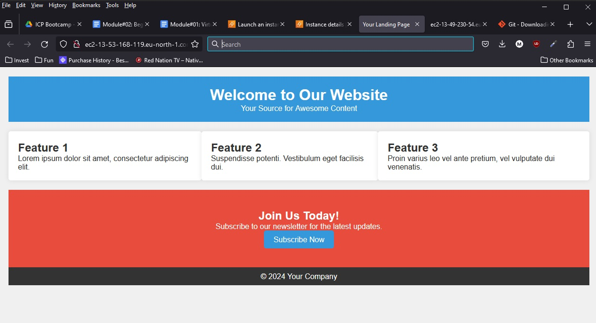

# README for AWS EC2 Web Server Setup Homework

## Results


## Overview
This README outlines the steps taken to deploy web files on an AWS EC2 instance and set up an Nginx web server. The process involves securely copying files to the EC2 instance, logging into the instance, installing Nginx, moving files to the appropriate directory, and ensuring Nginx runs on server startup.

### File Transfer
1. **Upload Site Files to EC2 Instance:**
   ```bash
   scp -i "<path>\Maris_Svirksts.pem" "AWSFiles\styles.css" "AWSFiles\index.html" ec2-user@ec2-13-53-168-119.eu-north-1.compute.amazonaws.com:/tmp/
   ```

### Accessing the Instance
2. **SSH into EC2 Instance:**
   ```bash
   ssh -i "<path>\Maris_Svirksts.pem" ec2-user@ec2-13-53-168-119.eu-north-1.compute.amazonaws.com
   ```

### Server Setup
3. **Install Nginx Web Server:**
   ```bash
   sudo yum install nginx
   ```

4. **Move Files to Nginx Directory:**
   ```bash
   sudo mv /tmp/styles.css /usr/share/nginx/html/
   sudo mv /tmp/index.html /usr/share/nginx/html/
   ```

### Server Management
5. **Start Nginx Web Server:**
   ```bash
   sudo service nginx start
   ```

6. **Enable Nginx on Server Start:**
   ```bash
   sudo chkconfig nginx on
   ```

### Note
- Direct file transfer to the Nginx directory was not possible due to permission restrictions. With appropriate permissions, the file transfer process could be streamlined.
   ```bash
   scp -i "<path>\Maris_Svirksts.pem" "AWSFiles\styles.css" "AWSFiles\index.html" ec2-user@ec2-13-53-168-119.eu-north-1.compute.amazonaws.com:/usr/share/nginx/html
   ```

---

## Additional Information
- Ensure you replace `<path>` with the actual path to your `.pem` file.
- The commands provided are specific to a Linux-based EC2 instance and may vary for other operating systems.
- I used ChatGPT 4 to add Markup language code and polish the content look and feel. The commands and overall logic is my own.
