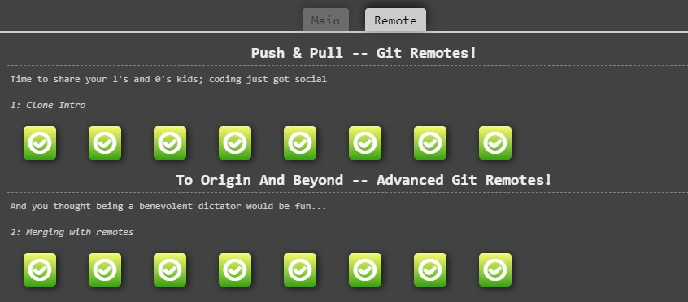

# List of git commands required to fulfill tasks on learngitbranching.js.org

**Note: This document is still a work in progress.**

## Introduction Sequence

### Introduction to Git Commits
- `git commit`
- `git commit`

### Branching in Git
- `git checkout -b bugFix`

### Merging in Git
- `git commit`
- `git branch bugFix`
- `git checkout C1`
- `git commit`

### Rebase Introduction
- `git branch bugFix`
- `git checkout bugFix`
- `git commit`
- `git checkout main`
- `git commit`
- `git merge bugFix`

## Ramping Up

### Detach yo' HEAD
- `git checkout C4`

### Relative Refs
- `git checkout C3`

### Relative Refs #2 (~)
- `git branch -f main C6`
- `git branch -f bugFix C0`
- `git checkout C1`

### Reversing Changes in Git
- `git checkout C2`
- `git revert HEAD`
- `git branch -f pushed c2'`
- `git checkout C3`
- `git branch -f local C1`

## Moving Work Around

### Cherry-pick Intro
- `git cherry-pick C3 C4 C7`

### Interactive Rebase Intro
- `git rebase -i C1`

## A Mixed Bag

### Grabbing Just 1 Commit
- `git rebase -i C1`
- `git branch -f main C4'`

### Juggling Commits
- `git rebase -i C1`
- `.........`

### Juggling Commits #2

### Git Tags

### Git Describe

## Advanced Topics

### Rebasing over 9000 times

### Multiple parents

### Branch Spaghetti

## Push & Pull -- Git Remotes!

### Clone Intro
- `git clone`

### Remote Branches
- `git checkout main`
- `git commit`
- `git checkout C1`
- `git commit`

### Git Fetchin'
- `git fetch`

### Git Pullin'
- `git pull`

### Faking Teamwork
- `git clone`
- `git fakeTeamwork 2`
- `git checkout main`
- `git commit`
- `...........`

### Git Pushin'

### Diverged History

### Locked Main

## To Origin And Beyond -- Advanced Git Remotes!

### Push Main!

### Merging with remotes

### Remote Tracking

### Git push arguments

### Git push arguments -- Expanded!

### Fetch arguments

### Source of nothing

### Pull arguments

## Additional Information
- I used ChatGPT 4 to add Markup language code. The commands and overall logic is my own.
- The list is not complete and requires additional work.
