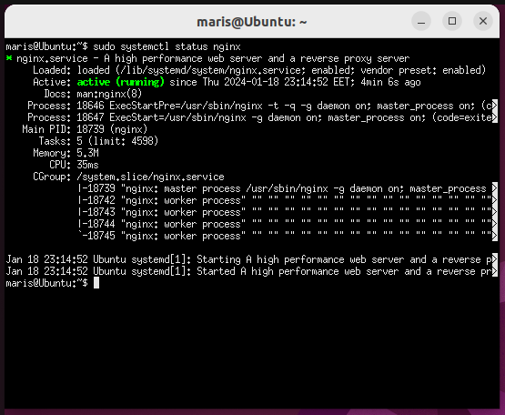
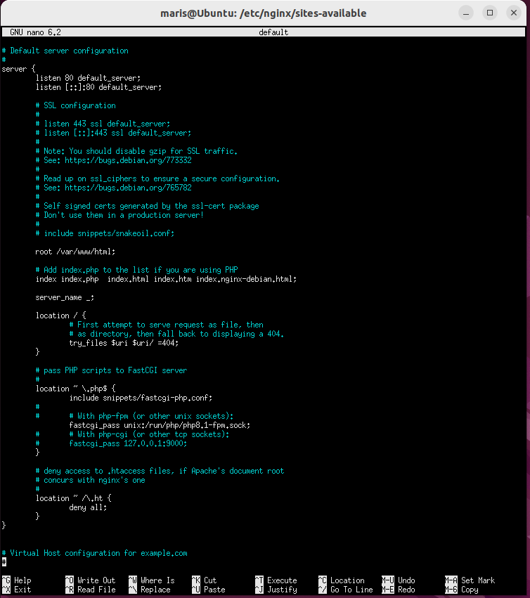
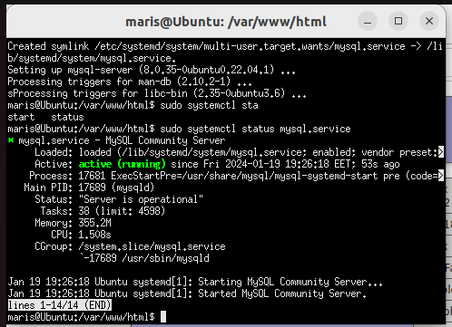
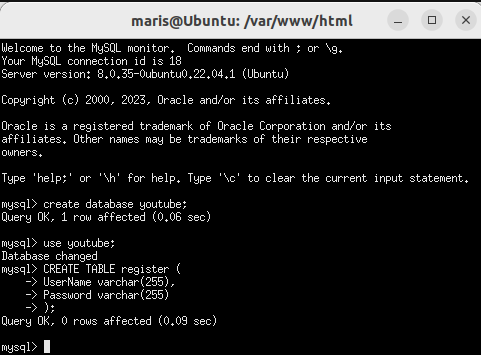
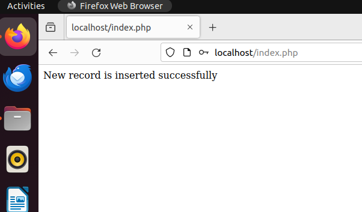
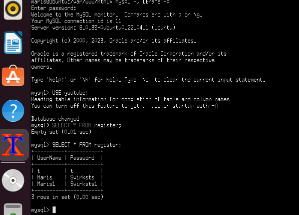

# Webserver, Database and their connection.

## The Task

### Objective
Set up an Nginx webserver, PHP, MySQL database and save data from website to the database.

### Commands

#### Install and Set up Nginx
```bash
sudo apt-get update
sudo apt-get upgrade
sudo apt-get install nginx
sudo apt-get install ufw
sudo ufw app list
sudo ufw allow "Nginx HTTP"
sudo systemctl status nginx
```



#### Install PHP and add support to Nginx
```bash
sudo apt-get install php-fpm 

sudo nano /etc/nginx/sites-available/default
```



```bash
sudo nginx -t
sudo systemctl restart nginx
```

#### Install MySQL
```bash
sudo apt-get install mysql-server mysql-client
sudo mysql_secure_installation
sudo apt-get install php-mysqli
sudo systemctl restart nginx
```



#### Install MySQLi Extension
```bash
sudo apt-get install php-mysqli
sudo systemctl restart nginx
```

#### Create database, table and set permissions.
```bash
sudo mysql -u root -p

CREATE DATABASE youtube;
USE youtube;

CREATE TABLE register (
    UserName varchar(255),
    Password varchar(255)
);

CREATE USER 'DBname'@'localhost' IDENTIFIED BY 'DBpassword';
GRANT ALL PRIVILEGES ON youtube.* TO 'DBname'@'localhost';
FLUSH PRIVILEGES;

exit
```



#### Update website data
```bash
# Before logging into the server.
scp -i "<path>\Maris_Svirksts.pem" "3BHomeWorkFiles\3BHomeWorkCode.php" "3BHomeWorkFiles\index.html" ec2-user@ec2-13-53-168-119.eu-north-1.compute.amazonaws.com:/tmp/

# After loging into the server.
sudo mv /var/www/html/index.html /var/www/html/index.html.old
sudo mv /var/www/html/index.nginx-debian.html /var/www/html/index.nginx-debian.html.old

sudo mv /tmp/3BHomeWorkCode.php /var/www/html/index.php 
sudo mv /tmp/index.html /var/www/html/index.html 
```

### End results




## Additions
- ```bash sudo lsof -i :80 ``` # Check if something is already running on port 80
- ```bash php -v  ``` # verify that php is working
- Website code by Mohammad Umar Khan