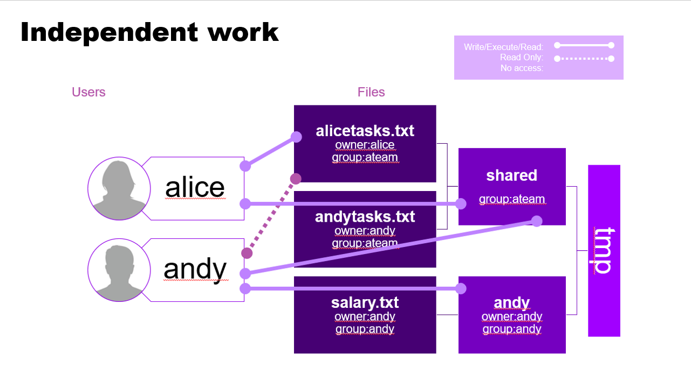
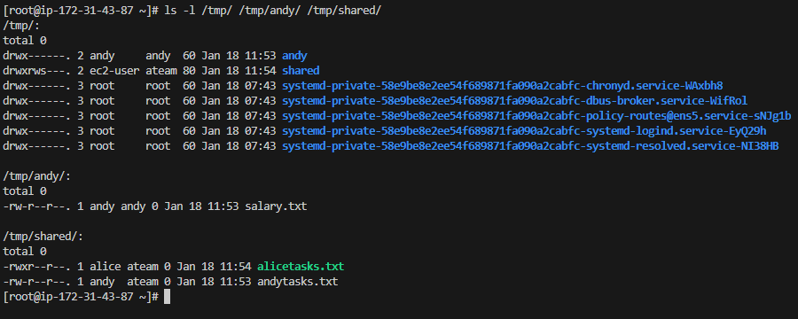

# Creating Linux Users and Groups

## The Task

### Objective
Create Linux users, groups and permissions according to the specified requirements.



### Commands

#### Creating Groups
```bash
sudo groupadd ateam
```

#### Creating Users
```bash
sudo useradd -G ateam alice
sudo useradd -G ateam andy
```

#### Setting Passwords
```bash
sudo passwd alice
sudo passwd andy
```

#### Create directories  and set their permissions.
```bash
umask 077

mkdir /tmp/shared/ /tmp/andy/

sudo chown :ateam /tmp/shared/
sudo chmod g=rwx /tmp/shared/
chmod g+s /tmp/shared/

chown andy:andy /tmp/andy/
```

#### Create files for andy and set their permissions.
```bash
su - andy
touch /tmp/andy/salary.txt /tmp/shared/andytasks.txt
exit
```

#### Create files for alice and set their permissions.
```bash
su - alice
touch /tmp/shared/alicetasks.txt
chmod u=rwx,g=r /tmp/shared/alicetasks.txt
exit
```

### Visual Representation


## Cleanup

### Removing Users and Groups
After completing the tasks, clean the system using the following commands:

#### Delete Users
```bash
sudo userdel alice
sudo userdel andy
```

#### Delete Groups
```bash
sudo groupdel ateam
```

#### Delete Folders & Files
```bash
sudo rm -fr /tmp/shared/ /tmp/andy/
```

#### Reset parameters
```bash
umask 022
```

## Additional Information
- I used ChatGPT 4 to add Markup language code. The commands and overall logic is my own.
- groups will automatically be delted when the last user that's within that group is deleted.
