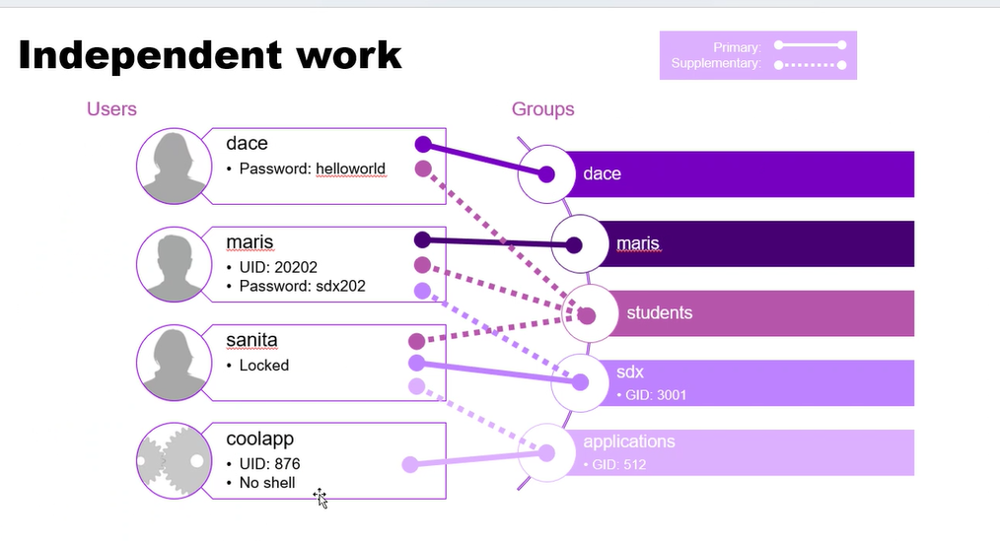
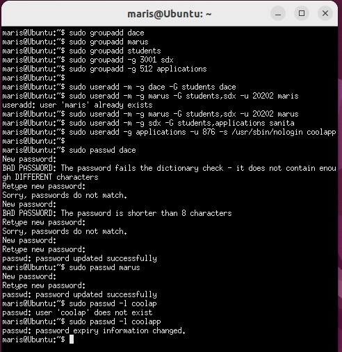

# Creating Linux Users and Groups

## The Task

### Objective
Create Linux users and groups according to the specified requirements.



### Commands

#### Creating Groups
```bash
sudo groupadd dace
sudo groupadd maris
sudo groupadd students
sudo groupadd -g 3001 sdx
sudo groupadd -g 512 applications
```

#### Creating Users
```bash
sudo useradd -m -g dace -G students dace
sudo useradd -m -g maris -G students,sdx -u 20202 maris
sudo useradd -m -g sdx -G students,applications sanita
sudo useradd -g applications -u 876 -s /usr/sbin/nologin coolapp
```

#### Setting Passwords
```bash
sudo passwd dace
sudo passwd maris
```

#### Locking User Account
```bash
sudo passwd -l coolap
```

**Note:** The `-m` flag is used to ensure that a home directory is created for each user, as it is not added by default.

### Visual Representation


## Cleanup

### Removing Users and Groups
After completing the tasks, clean the system using the following commands:

#### Delete Users
```bash
for u in dace maris sanita coolapp; do 
    echo "$u"; 
    sudo userdel "$u"; 
done
```

#### Delete Groups
```bash
for u in dace maris students sdx applications; do 
    echo "$u"; 
    sudo groupdel "$u"; 
done
```

## Additional Information
- I used ChatGPT 4 to add Markup language code. The commands and overall logic is my own.
- Some groups might already be deleted when the last user in that group is removed. In such cases, a warning message will appear.
