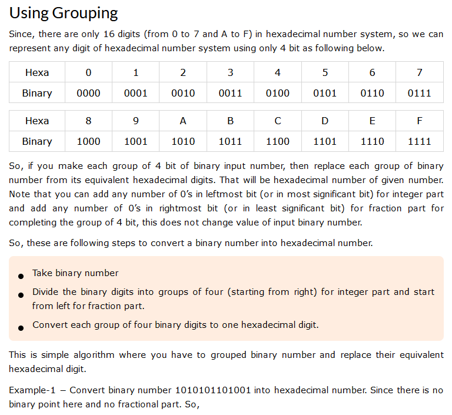

# Number System Conversions

This document explains how to convert numbers between binary, decimal, and hexadecimal systems. Each section includes a method for conversion and an example to illustrate the process.

## Binary to Decimal

**Method:**
To convert a binary number to decimal, multiply each bit by 2 raised to the power of its position number (starting from 0 from the right) and sum all the results.

**Example:**
Binary: `1011`

Calculation:
1. \(1 	imes 2^3\) = 8
2. \(0 	imes 2^2\) = 0
3. \(1 	imes 2^1\) = 2
4. \(1 	imes 2^0\) = 1

Decimal: \(8 + 0 + 2 + 1 = 11\)

## Decimal to Binary

**Method:**
To convert a decimal number to binary, divide the number by 2 and record the remainder. Continue dividing the quotient by 2 until you reach a quotient of 0. The binary number is the sequence of remainders read from bottom to top.

**Example:**
Decimal: `13`

Calculation:
1. \(13 \div 2\) = 6 remainder 1
2. \(6 \div 2\) = 3 remainder 0
3. \(3 \div 2\) = 1 remainder 1
4. \(1 \div 2\) = 0 remainder 1

Binary: `1101`

## Decimal to Hexadecimal

**Method:**
To convert a decimal number to hexadecimal, divide the number by 16 and record the remainder. Continue dividing the quotient by 16 until you reach a quotient of 0. The hexadecimal number is the sequence of remainders (converted to hexadecimal notation if above 9) read from bottom to top.

**Example:**
Decimal: `30`

Calculation:
1. \(30 \div 16\) = 1 remainder 14 (E in hexadecimal)

Hexadecimal: `1E`

## Hexadecimal to Decimal

**Method:**
To convert a hexadecimal number to decimal, multiply each digit by 16 raised to the power of its position number (starting from 0 from the right) and sum all the results.

**Example:**
Hexadecimal: `1E`

Calculation:
1. \(1 	imes 16^1\) = 16
2. \(E (14) 	imes 16^0\) = 14

Decimal: \(16 + 14 = 30\)

## Binary to Hexadecimal

**Method:**
To convert a binary number to hexadecimal, group the binary number into sets of four bits starting from the right. If necessary, pad the leftmost group with additional zeros to make a set of four. Convert each group into its hexadecimal equivalent.

**Example:**
Binary: `1101011`

Grouping: `0110 1011`

Calculation:
1. `0110` = 6
2. `1011` = B

Hexadecimal: `6B`

## Hexadecimal to Binary

**Method:**
To convert a hexadecimal number to binary, convert each hexadecimal digit into its four-bit binary equivalent.

**Example:**
Hexadecimal: `1A`

Calculation:
1. `1` = `0001`
2. `A (10)` = `1010`

Binary: `00011010`
