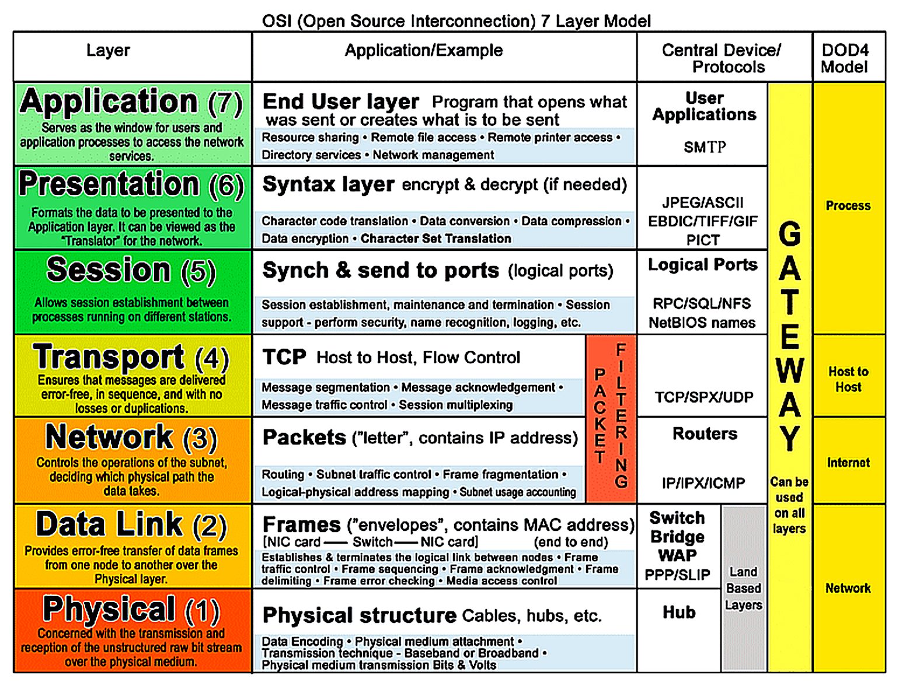

**Layer 7: Application layer**

See what was sent.

The application layer includes processes that directly involve the everyday user. This layer includes all of the networking protocols that software applications use to connect a user to the internet. This characteristic is the identifying feature of the application layer—user connection to the network via applications and requests.

An example of a type of communication that happens at the application layer is using a web browser. The internet browser uses HTTP or HTTPS to send and receive information from the website server. The email application uses simple mail transfer protocol (SMTP) to send and receive email information. Also, web browsers use the domain name system (DNS) protocol to translate website domain names into IP addresses which identify the web server that hosts the information for the website.

* HTTP (Hypertext Transfer Protocol) (80, 8080)
* HTTPS (HTTP Secure) (443)
* FTP (File Transfer Protocol) (20, 21)
* SMTP (Simple Mail Transfer Protocol) (25, 587)
* POP3 (Post Office Protocol 3) (110)
* IMAP (Internet Message Access Protocol) (143, 993)
* DNS (Domain Name System) (53)
* SNMP (Simple Network Management Protocol) (161, 162)
* Telnet (Remote Terminal Emulation) (23)
* SSH (Secure Shell) (22)
* DHCP (Dynamic Host Configuration Protocol) (67, 68)

**Layer 6: Presentation layer**

Present everything that you are sending.

Functions at the presentation layer involve data translation and encryption for the network. This layer adds to and replaces data with formats that can be understood by applications (layer 7) on both sending and receiving systems. Formats at the user end may be different from those of the receiving system. Processes at the presentation layer require the use of a standardized format.

Some formatting functions that occur at layer 6 include encryption, compression, and confirmation that the character code set can be interpreted on the receiving system. One example of encryption that takes place at this layer is SSL, which encrypts data between web servers and browsers as part of websites with HTTPS.

* TLS/SSL (Transport Layer Security / Secure Sockets Layer) (Used with protocols like HTTPS, SMTPS, IMAPS, etc.)
* JPEG (Joint Photographic Experts Group)
* GIF (Graphics Interchange Format)
* MPEG (Moving Picture Experts Group)
* ASCII (American Standard Code for Information Interchange)
* EBCDIC (Extended Binary Coded Decimal Interchange Code)

**Layer 5: Session layer**

How long will the session be, will it be active or passive?

A session describes when a connection is established between two devices. An open session allows the devices to communicate with each other. Session layer protocols occur to keep the session open while data is being transferred and terminate the session once the transmission is complete.

The session layer is also responsible for activities such as authentication, reconnection, and setting checkpoints during a data transfer. If a session is interrupted, checkpoints ensure that the transmission picks up at the last session checkpoint when the connection resumes. Sessions include a request and response between applications. Functions in the session layer respond to requests for service from processes in the presentation layer (layer 6) and send requests for services to the transport layer (layer 4).

* NetBIOS (Network Basic Input/Output System)
* RPC (Remote Procedure Call)
* PPTP (Point-to-Point Tunneling Protocol) (1723)
* SMB (Server Message Block)
* NFS (Network File System)
* RTP (Real-time Transport Protocol) (Dynamic port range 16384-32767)

**Layer 4: Transport layer**

Buss that will take you to the destination, on the road.

The transport layer is responsible for delivering data between devices. This layer also handles the speed of data transfer, flow of the transfer, and breaking data down into smaller segments to make them easier to transport. Segmentation is the process of dividing up a large data transmission into smaller pieces that can be processed by the receiving system. These segments need to be reassembled at their destination so they can be processed at the session layer (layer 5). The speed and rate of the transmission also has to match the connection speed of the destination system. TCP and UDP are transport layer protocols.

* TCP (Transmission Control Protocol)
* UDP (User Datagram Protocol)
* SCTP (Stream Control Transmission Protocol)
* DCCP (Datagram Congestion Control Protocol)

**Layer 3: Network layer**

Send data through the internet: road.

The network layer oversees receiving the frames from the data link layer (layer 2) and delivers them to the intended destination. The intended destination can be found based on the address that resides in the frame of the data packets. Data packets allow communication between two networks. These packets include IP addresses that tell routers where to send them. They are routed from the sending network to the receiving network.

* IP (Internet Protocol)
* ICMP (Internet Control Message Protocol)
* IGMP (Internet Group Management Protocol)
* ARP (Address Resolution Protocol)
* RARP (Reverse Address Resolution Protocol)

Routing: [https://www.cisco.com/c/en/us/products/routers/what-is-routing.html#~methods-by-network-size](https://www.cisco.com/c/en/us/products/routers/what-is-routing.html#~methods-by-network-size)

**Layer 2: Data link layer**

Send data within the local network.

The data link layer organizes sending and receiving data packets within a single network. The data link layer is home to switches on the local network and network interface cards on local devices.

Protocols like network control protocol (NCP), high-level data link control (HDLC), and synchronous data link control protocol (SDLC) are used at the data link layer.

* Ethernet
* Wi-Fi (IEEE 802.11)
* PPP (Point-to-Point Protocol)
* Frame Relay
* ATM (Asynchronous Transfer Mode)

**Layer 1: Physical layer**

As the name suggests, the physical layer corresponds to the physical hardware involved in network transmission. Hubs, modems, and the cables and wiring that connect them are all considered part of the physical layer. To travel across an ethernet or coaxial cable, a data packet needs to be translated into a stream of 0s and 1s. The stream of 0s and 1s are sent across the physical wiring and cables, received, and then passed on to higher levels of the OSI model.

* Ethernet (Physical medium used for LANs)
* DSL (Digital Subscriber Line)
* ISDN (Integrated Services Digital Network)
* USB (Universal Serial Bus)
* Bluetooth
* IEEE 802.3 (Ethernet standard)

