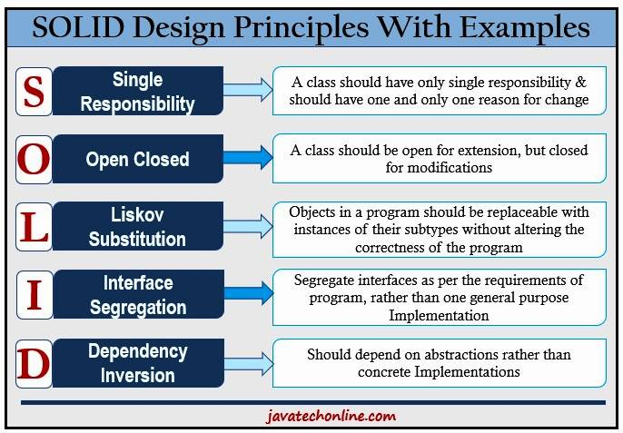

# SOLID Principles with Examples

SOLID is an acronym that represents five key design principles in object-oriented programming and design. These principles help developers create more maintainable, understandable, and flexible software.



## S - Single Responsibility Principle (SRP)

_A class should have only one reason to change._

### Example:
```python
# Good: Each class has a single responsibility
class User:
    def __init__(self, name: str):
        self.name = name

class UserDB:
    def get_user(self, user_id):
        pass
    def save_user(self, user):
        pass
```

## O - Open/Closed Principle (OCP)

_Software entities should be open for extension, but closed for modification._

### Example:
```python
# Good: Extended without modifying existing behavior
class Animal:
    def speak(self):
        pass

class Dog(Animal):
    def speak(self):
        return "Woof!"

class Cat(Animal):
    def speak(self):
        return "Meow!"
```

## L - Liskov Substitution Principle (LSP)

_Objects of a superclass should be replaceable with objects of a subclass._

### Example:
```python
# Good: Subtypes are substitutable for their base types
def animal_sound(animals: list[Animal]):
    for animal in animals:
        print(animal.speak())

animals = [Dog(), Cat()]
animal_sound(animals)
```

## I - Interface Segregation Principle (ISP)

_No client should be forced to depend on methods it does not use._

### Example:
```python
# Good: Interfaces are specific to client requirements
from abc import ABC, abstractmethod

class Feeder(ABC):
    @abstractmethod
    def feed(self):
        pass

class Pet(Feeder):
    def feed(self):
        print("Feeding pet")
```

## D - Dependency Inversion Principle (DIP)

_High-level modules should not depend on low-level modules._

### Example:
```python
# Good: Depend on abstractions, not on concretions
class Content(ABC):
    @abstractmethod
    def fetch_content(self):
        pass

class NewsContent(Content):
    def fetch_content(self):
        return "News content"

class App:
    def display(self, content: Content):
        print(content.fetch_content())

app = App()
news = NewsContent()
app.display(news)
```

Understanding and applying the SOLID principles can lead to better software development outcomes, making code more extendable, logical, and easier to read.
