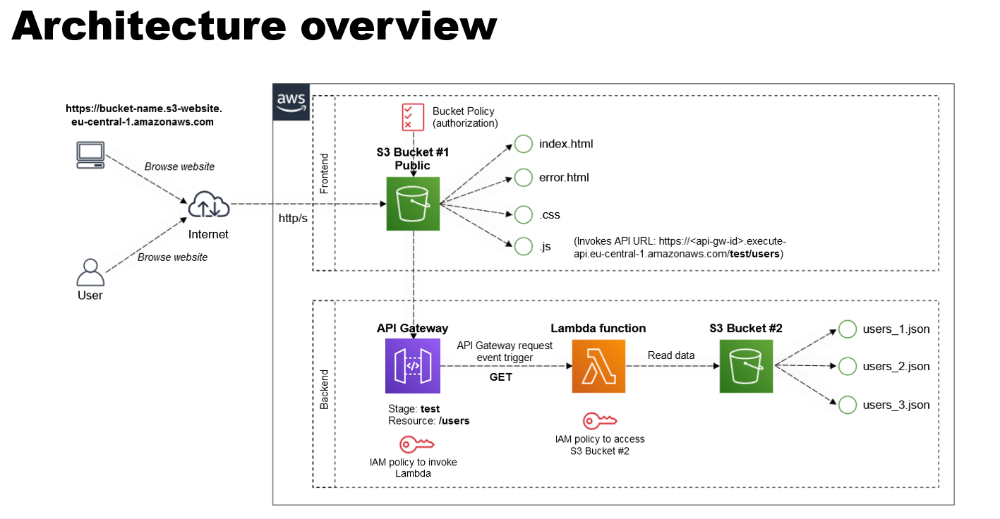
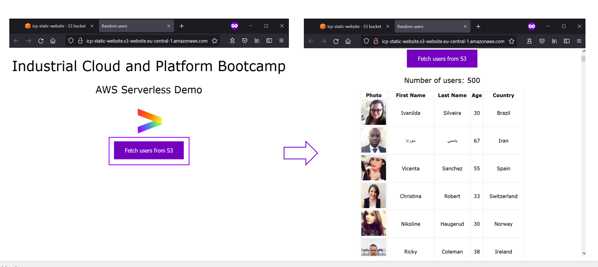

# Project Documentation

## Overview
This project demonstrates an integration of AWS services including AWS Lambda and S3, leveraging Terraform for deploying a scalable web application. It aims to showcase automation in infrastructure deployment, efficient user data management, and static web content delivery.





## Prerequisites
Before starting, ensure you have:
- An active AWS account with permissions for Lambda, S3, and other related services.
- Terraform, for infrastructure as code deployment.
- A Python environment, for AWS Lambda function and support function modifications.

## Getting Started
### Clone the Project
Clone or download the project to your local machine. 

### Environment Setup
- **AWS CLI**: Install and configure with your AWS credentials.
- **Terraform**: Initialize in the project directory for infrastructure deployment preparation.

## Deployment Instructions
### Starting the Infrastructure
1. Open the project's root directory in your terminal.
2. Execute `./start.sh` to deploy the AWS resources via Terraform.
3. Upon successful deployment, URLs for the S3-hosted website and other services will be provided.

### Destroying the Infrastructure
To remove deployed resources and avoid unnecessary costs, execute `./destroy.sh` from the root directory.

## AWS Lambda Function
`Lambda/lambda_function.py` contains the Python code for AWS Lambda, designed for specific tasks like HTTP request handling. Update `Lambda/resources.tf` with any new dependencies when modifying the function.

## Terraform Configuration
### Lambda Configuration
- `providers.tf`: Sets up the AWS provider.
- `resources.tf`: Defines the AWS Lambda function, its handler, and IAM roles.
- `variables.tf`: Declares variables for Lambda configuration customization.

### S3 Bucket Configuration
Configures an S3 bucket for web content hosting and user data storage, with a structure similar to the Lambda configuration.

## Support Functions
`supportFunctions/functions.py` includes utility functions for data processing or API interactions, usable within AWS Lambda or elsewhere in the project.

## Bucket Policy
```yml
{
	"Version": "2012-10-17",
	"Statement": [
		{
			"Sid": "PublicReadGetObject",
			"Effect": "Allow",
			"Principal": "*",
			"Action": [
				"s3:GetObject"
			],
			"Resource": [
				"arn:aws:s3:::BUCKET_NAME/*"
			]
		}
	]
}
```

## User Data Management
The `userData` directory contains JSON files for user data, customizable to include additional information while maintaining a consistent data structure.

## Website Data
Customize the web application's appearance and functionality by modifying the files in the `websiteData` directory:
- `index.html`: Main webpage.
- `error.html`: Error page.
- `style.css`: Website styling.
- `userData.js`: Client-side user data handling.

## Best Practices
- Update AWS and Terraform configurations for security compliance.
- Secure AWS credentials and use minimal privilege IAM roles.
- Review and test code for security vulnerabilities regularly.

## Troubleshooting
Address common issues related to permissions, configurations, or script executions by ensuring proper AWS CLI and Terraform setup.

## FAQs
**Q: How do I update the Lambda function code?**
A: Modify `Lambda/lambda_function.py` and redeploy with `start.sh`.

**Q: Can I add more S3 buckets or Lambda functions?**
A: Yes, update the Terraform files and apply changes with `terraform apply`.
