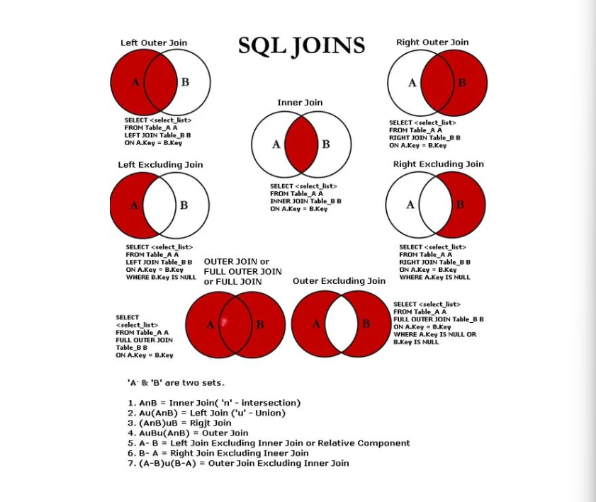

# SQL JOIN Types

SQL JOINs are used to combine rows from two or more tables, based on a related column between them. Understanding the different types of JOINs in SQL is crucial for querying databases effectively. Here are the main types of JOINs available in SQL:

## 1. INNER JOIN
The INNER JOIN keyword selects records that have matching values in both tables involved in the join. It returns the intersection of the two tables.

```sql
SELECT Orders.order_id, Customers.customer_name
FROM Orders
INNER JOIN Customers ON Orders.customer_id = Customers.customer_id;
```

## 2. LEFT JOIN (or LEFT OUTER JOIN)
The LEFT JOIN keyword returns all records from the left table (table1), and the matched records from the right table (table2). The result is NULL from the right side if there is no match.

```sql
SELECT Orders.order_id, Customers.customer_name
FROM Orders
LEFT JOIN Customers ON Orders.customer_id = Customers.customer_id;
```

## 3. RIGHT JOIN (or RIGHT OUTER JOIN)
The RIGHT JOIN keyword returns all records from the right table (table2), and the matched records from the left table (table1). The result is NULL from the left side if there is no match.

```sql
SELECT Orders.order_id, Customers.customer_name
FROM Orders
RIGHT JOIN Customers ON Orders.customer_id = Customers.customer_id;
```

## 4. FULL JOIN (or FULL OUTER JOIN)
The FULL OUTER JOIN keyword returns all records when there is a match in either left (table1) or right (table2) table records. It combines the results of both LEFT JOIN and RIGHT JOIN.

```sql
SELECT Orders.order_id, Customers.customer_name
FROM Orders
FULL OUTER JOIN Customers ON Orders.customer_id = Customers.customer_id;
```

(Note: FULL JOIN is not supported in MySQL.)

## 5. CROSS JOIN
The CROSS JOIN keyword returns the Cartesian product of the two tables involved in the join. This means it will combine each row from the first table with each row from the second table.

```sql
SELECT Orders.order_id, Customers.customer_name
FROM Orders
CROSS JOIN Customers;
```

## 6. SELF JOIN
A SELF JOIN is a regular join, but the table is joined with itself. It's useful for comparing rows within the same table.

```sql
SELECT A.customer_name AS CustomerName1, B.customer_name AS CustomerName2
FROM Customers A, Customers B
WHERE A.customer_id <> B.customer_id;
```

## 7. NATURAL JOIN
A NATURAL JOIN is a type of join that automatically joins tables based on columns with the same names and compatible data types in both tables. It eliminates the need to specify the JOIN condition explicitly.

```sql
SELECT *
FROM Orders
NATURAL JOIN Customers;
```

When using JOINs, always consider the specific requirements of your query to choose the most appropriate type of JOIN. Each JOIN type serves different use cases and can significantly impact the results and performance of your SQL queries.



